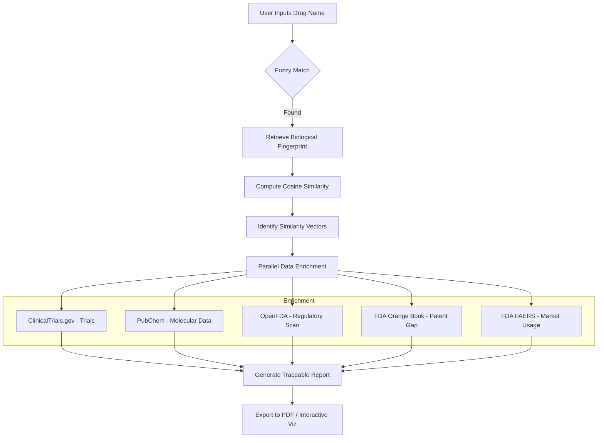

# DrugNova AI 🔬
### Autonomous Drug Repurposing & Market Intelligence Platform

DrugNova AI is an advanced research platform that identifies repurposing opportunities for over 19,000+ approved and experimental compounds. By computing biological similarity across gene targets and pathways, it generates traceable reports for candidate diseases, enriched with real-time clinical, regulatory, and patent data.

---

## 🚀 Key Features

- **Biological Similarity Engine**: Uses high-dimensional feature vectors (gene targets + pathways + ATC class) and cosine similarity to find repurposing candidates.
- **Dynamic Vector Explorer**: SVG-powered visualization of similarity vectors between the input drug and candidates.
- **Automated Intelligence**: Aggregates data from ClinicalTrials.gov, PubChem, OpenFDA, and the FDA Orange Book.
- **Traceable Reports**: Every finding includes primary source citations (DrugBank IDs, clinical trial IDs, etc.).
- **Professional PDF Export**: Generate dark-themed, data-rich analysis reports using `jsPDF`.
- **JWT Authentication**: User-specific profiles with adaptive UI based on research purpose (Academic, Discovery, Healthcare, etc.).

---

## 🛠️ Tech Stack

- **Backend**: Python 3.10+, FastAPI, Pandas, RapidFuzz, Scikit-learn, SQLite.
- **Frontend**: React 19, Vite, Lucide React, SVG Animations.
- **Reporting**: jsPDF (Professional PDF Generation).
- **Design**: Premium Glassmorphism UI, Responsive Web Design.

---

## 📁 Project Structure

```
DrugNova-AI/
├── data/                            # Core Databanks (Local CSVs)
│   ├── drugs_core.csv               # 19,842 rows — drug groups, indications, disease areas
│   ├── targets.csv                  # 34,931 rows — drugbank_id ↔ gene_symbol mapping
│   ├── pathways.csv                 # 205,292 rows — drugbank_id ↔ pathway mapping
│   ├── patents_all.csv              # FDA Orange Book patent & exclusivity records
│   ├── atc_codes.csv                # ATC hierarchy classification
│   └── drug_interactions_part[1-4].csv # 2.9M+ interaction records
│
├── backend/                         # FastAPI Application
│   ├── modules/
│   │   ├── data_layer.py            # Fuzzy drug lookup + CSV management
│   │   ├── model.py                 # Cosine similarity engine + vector generation
│   │   ├── explainer.py             # Biological similarity reasoning
│   │   ├── interactions.py          # Interaction query engine (SQLite)
│   │   ├── patent.py                # FDA Orange Book patent analysis
│   │   ├── regulatory_api.py        # OpenFDA regulatory scan
│   │   ├── market_api.py            # FDA FAERS market size signals
│   │   └── external_apis.py         # ClinicalTrials.gov & PubChem
│   ├── utils/
│   │   ├── contracts.py             # Shared Pydantic data models
│   │   └── db.py                    # SQLite connection utilities
│   ├── auth.py                      # JWT Authentication & User Management
│   └── main.py                      # FastAPI entry point & API orchestration
│
├── frontend-react/                  # Modern React Frontend (Vite)
│   ├── src/
│   │   ├── App.jsx                  # Main dashboard & API integration
│   │   ├── Login.jsx                # Auth flow (Register/Login)
│   │   ├── Profile.jsx              # User preferences & Purpose selection
│   │   ├── DrugSimilarityViz.jsx    # SVG Vector Visualization
│   │   ├── CarbonLoading.jsx        # Premium micro-animations
│   │   └── BioBackground.jsx        # Interactive background effects
│   └── vite.config.js               # Frontend build config
│
├── scripts/                         # Maintenance Scripts
│   └── build_interactions_db.py     # CSV to SQLite conversion (Run once)
│
├── interactions.db                  # Ingested interaction database (Local)
└── requirements.txt                 # Python dependencies
```

---

## 🧪 How it works



---

## 🔧 Setup & Installation

### 1. Repository Setup
```bash
git clone https://github.com/varsha-12-22/DrugNova-AI.git
cd DrugNova-AI
```

### 2. Backend Environment
```bash
# Create and activate venv
python -m venv venv
# Linux/Mac: source venv/bin/activate
# Windows: venv\Scripts\activate

# Install dependencies
pip install -r requirements.txt

# Build the interactions database (requires local CSV files)
python scripts/build_interactions_db.py
```

### 3. Frontend Environment
```bash
cd frontend-react
npm install
```

### 4. Data Requirements
Download the core CSV files and place them in the `data/` directory:
- `drugs_core.csv`
- `targets.csv`
- `pathways.csv`
- `patents_all.csv`
- `atc_codes.csv`
- `drug_interactions_part1-4.csv`

---

## 🚦 Running the Application

### Start the Backend (Terminal 1)
```bash
# From project root
uvicorn backend.main:app --reload
```
*API available at `http://localhost:8000`*

### Start the Frontend (Terminal 2)
```bash
cd frontend-react
npm run dev
```
*UI available at `http://localhost:5173`*

---

## 🧬 Module Integration

Every module adheres to a strict contract defined in `backend/utils/contracts.py`.

**Example Result Schema:**
```json
{
  "module": "patents",
  "findings": [
    "FDA Orange Book — 12 patent records found",
    "Earliest patent expiry: Oct 23, 2026",
    "Repurposing window: APPROACHING — expires within 1 year"
  ],
  "sources": [
    {
      "label": "FDA Orange Book — Patent Data",
      "url": "https://www.accessdata.fda.gov/scripts/cder/ob/index.cfm"
    }
  ],
  "score": 0.85
}
```

---

> Built for the **Autonomous Research Orchestrator Hackathon**
> **Team:** 6 members | **Stack:** Python · FastAPI · React · Scikit-Learn
